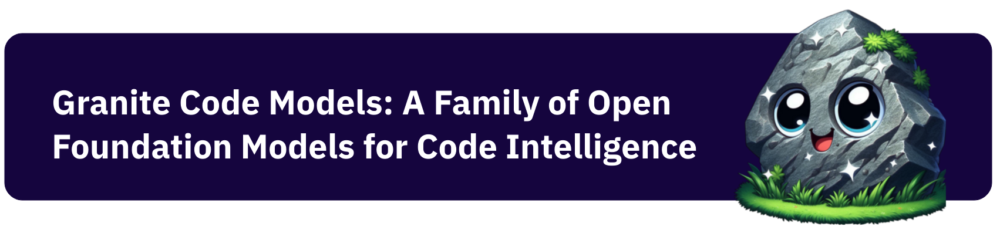

<p align="center">
  
</p>

<p align="center">
        :arrow_down: <a href="https://huggingface.co/collections/ibm-granite/granite-code-models-6624c5cec322e4c148c8b330"> Models Download</a>&nbsp | :newspaper: <a href="http://"> Blog</a>&nbsp | :books: <a href="https://">Paper Link </a>&nbsp
<br>

---
## Introduction to Granite Code Models
The **Granite Code Models** are a series of highly capable LLMs designed for code-related tasks. All Granite Code Models are released under [Apache 2.0 license](https://www.apache.org/licenses/LICENSE-2.0) and were built following transparent data collection and filtering practices. These two factors make these models ideal for enterprise commercial use. Moreover, without an impact on performance, our family of code-enterprise-ready models requires less computational resources than other open-source LLMs twice their size.

The family of **Granite Code Models** comes in two main variants:

* Granite Code Base Models: Base foundational models designed for general code generative tasks (e.g., code repair, code explanation, code synthesis).
* Granite Code Instruct Models: Instruction following models finetuned using Git commits paired with human instructions.

All variants are available in sizes of 3B, 8B, 20B, and 34B parameters.

## Pretraining Code Data
Our process to prepare code pretraining data involves four stages. First, we collect a combination of publicly available datasets (e.g., GitHub Code Clean, Starcoder data), public code repositories, and issues from GitHub. Second, we filter the code data collected based on programming language (which we determined based on file extension) and code quality. Third, we adopt an aggressive deduplication strategy that includes both exact and fuzzy deduplication to remove documents having (near) identical code content. Finally, we apply a HAP content filter that reduces models' likelihood of generating hateful, abusive, or profane language. We also make sure to redact Personally Identifiable Information (PII) by replacing PII content (e.g., names, email addresses, keys, passwords) with corresponding tokens (e.g., ⟨NAME⟩, ⟨EMAIL⟩, ⟨KEY⟩, ⟨PASSWORD⟩). We also scan all datasets using ClamAV to identify and remove instances of malware in the source code.
    
## Evaluation Results
We conduct an extensive evaluation of our code models on a comprehensive list of benchmarks that includes but is not limited to HumanEvalPack, MBPP, and MBPP+. This set of benchmarks encompasses different coding tasks across commonly used programming languages (e.g., Python, JavaScript, Java, Go, C++, Rust).

Our findings reveal that Granite Code models outperform strong open-source models across model sizes. To illustrate the performance of our. models, the figure below shows a comparison of `Granite-8B-Code-Base` and other open-source  LLMs, including recent high-performing general purpose base LLMs such as `Mistral-7B` and `LLama-3-8B`. For further information on evaluation results, please check our paper.
    


## Pretraining
We trained most **Granite Code Base Models** from scratch following a two-phase training strategy. In phase 1, we train the **Code Base Models** of 3,8, and 20B parameters on 3 to 4 trillion tokens sourced from code data in 116 programming languages, which ensures the models have a comprehensive understanding of programming languages and syntax. **Granite-34B-Code-Base** model is trained using depth upscaling from **Granite-20B-Code-Base** model. This model, in particular, is trained on 3 trillion tokens (1.4 trillion tokens after depthup scaling). In phase 2, we trained our models on 500 billion tokens with a carefully designed mixture of high-quality data from code and natural language domains to improve the models’ ability to reason and follow instructions. 

## Instruction Tuning
Granite Code Instruct models are finetuned on the following types of instruction data: 1) code commits sourced from [CommitPackFT](https://huggingface.co/datasets/bigcode/commitpackft), 2) high-quality math datasets, specifically we used [MathInstruct](https://huggingface.co/datasets/TIGER-Lab/MathInstruct) and [MetaMathQA](https://huggingface.co/datasets/meta-math/MetaMathQA), 3) Code instruction datasets such as [Glaive-Code-Assistant-v3](https://huggingface.co/datasets/glaiveai/glaive-code-assistant-v3), [Glaive-Function-Calling-v2](https://huggingface.co/datasets/glaiveai/glaive-function-calling-v2), [NL2SQL11](https://huggingface.co/datasets/bugdaryan/sql-create-context-instruction) and a small collection of synthetic API calling datasets, and 4) high-quality language instruction datasets such as [HelpSteer](https://huggingface.co/datasets/nvidia/HelpSteer) and an open license-filtered version of [Platypus](https://huggingface.co/datasets/garage-bAInd/Open-Platypus).

## How to Download our Models?
You can download our models from HuggingFace. First, please visit the model repository of your preference, for example, `ibm-granite/granite-3b-code-base`. To download the model (i.e., `granite-3b-code-base`), click on *Files and versions* tab and download the content of the `main` branch. You can also download our models via the command line by installing 'huggingface-hub` library. Another option is to clone a model's respective HuggingFace repository (i.e., `git clone git@hf.co:ibm-granite/granite-3b-code-base`).

## How to Use our Models?

This is a simple example of how to use **Granite-Code-Base-3B model**.

```python
import torch
from transformers import AutoModelForCausalLM, AutoTokenizer
device = "cuda" # or "cpu"
model_path = "ibm-granite/granite-3b-code-base"
tokenizer = AutoTokenizer.from_pretrained(model_path)
# drop device_map if running on CPU
model = AutoModelForCausalLM.from_pretrained(model_path, device_map=device)
model.eval()
# change input text as desired
input_text = "def generate():"
# tokenize the text
input_tokens = tokenizer(input_text, return_tensors="pt")
# transfer tokenized inputs to the device
for i in input_tokens:
    input_tokens[i] = input_tokens[i].to(device)
# generate output tokens
output = model.generate(**input_tokens)
# decode output tokens into text
output = tokenizer.batch_decode(output)
# loop over the batch to print, in this example the batch size is 1
for i in output:
    print(output)
```
## How to Contribute to this Project?
Plese check our [Guidelines](/CONTRIBUTING.md) and [Code of Conduct](/CODE_OF_CONDUCT.md) to contribute to our project.

## Model Cards
The model cards for each model variant are available in their respective HuggingFace repository. Please visit our collection [here](https://huggingface.co/collections/ibm-granite/granite-code-models-6624c5cec322e4c148c8b330).
    
## Research Paper
* Would you like to read our paper? Please click [here](https://www.overleaf.com/project/6520094b0a31c2dc6445597e).
* Would you like to cite our paper? Please do it this way:
    
```
@misc{granite-models,
  author = {author 1, author2, ...},
  title = {Granite Code Large Language Models: IBM Foundation Models for Code},
  journal = {},
  volume = {},
  year = {2024},
  url = {https://arxiv.org/abs/0000.00000},
}
```

## License 
All Granite Code Models are distributed under [Apache 2.0](./LICENSE) license.

## Would you like to provide feedback?
Please let use know your comments about our family of code models by visiting our [collection](https://huggingface.co/collections/ibm-granite/granite-code-models-6624c5cec322e4c148c8b330). Select the repository of the model you would like to provide feedback about. Then, go to *Community* tab, and click on *New discussion*.