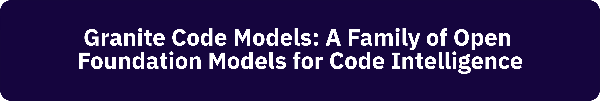
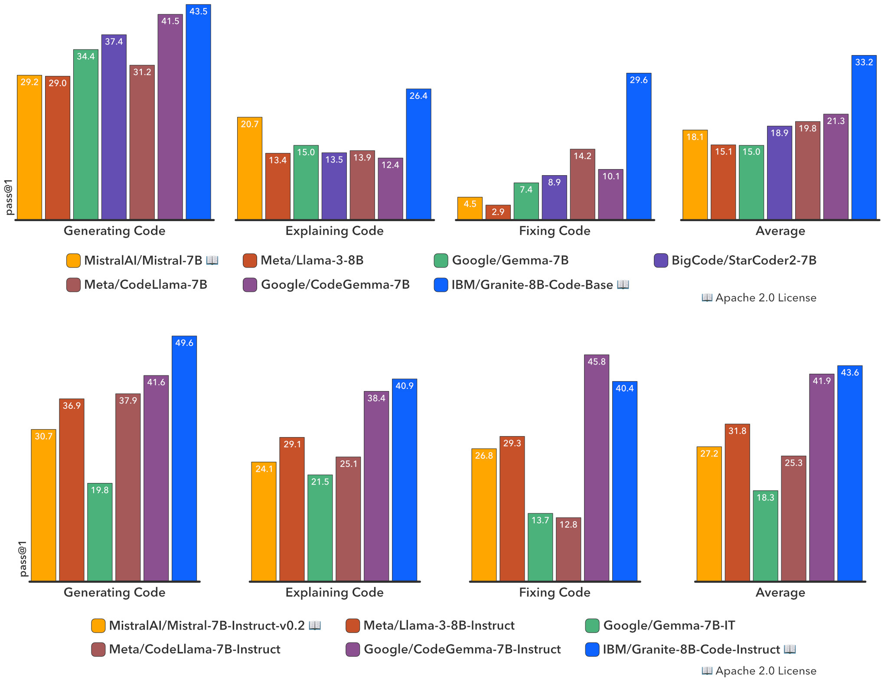

<p align="center">
  
</p>

<p align="center">
  :books: <a href="https://arxiv.org/abs/2405.04324">Paper</a>&nbsp | :hugs: <a href="https://huggingface.co/collections/ibm-granite/granite-code-models-6624c5cec322e4c148c8b330">HuggingFace Collection</a>&nbsp | 
  :speech_balloon: <a href="https://github.com/orgs/ibm-granite/discussions">Discussions Page</a>&nbsp
<br>

---
## Introduction to Granite Code Models
We introduce the Granite series of decoder-only code models for code generative tasks (e.g., fixing bugs, explaining code, documenting code), trained with code written in 116 programming languages. A comprehensive evaluation of the Granite Code model family on diverse tasks demonstrates that our models consistently reach state-of-the-art performance among available open source code LLMs.  

The key advantages of Granite Code models include:
* All-rounder Code LLM: Granite Code models achieve competitive or state-of-the-art performance on different kinds of code-related tasks, including code generation, explanation, fixing, editing, translation, and more. Demonstrating their ability to solve diverse coding tasks.
* Trustworthy Enterprise-Grade LLM: All our models are trained on license-permissible data collected following [IBM's AI Ethics principles](https://www.ibm.com/impact/ai-ethics) and guided by IBM’s Corporate Legal team for trustworthy enterprise usage. We release all our Granite Code models under an [Apache 2.0 license](https://www.apache.org/licenses/LICENSE-2.0) license for research and commercial use.

The family of **Granite Code Models** comes in two main variants:

* Granite Code Base Models: base foundational models designed for code-related tasks (e.g., code repair, code explanation, code synthesis).
* Granite Code Instruct Models: instruction following models finetuned using a combination of Git commits paired with human instructions and open source synthetically generated code instruction datasets.

Both base and instruct models are available in sizes of 3B, 8B, 20B, and 34B parameters.

## Data Collection
Our process to prepare code pretraining data involves several stages. First, we collect a combination of publicly available datasets (e.g., GitHub Code Clean, Starcoder data), public code repositories, and issues from GitHub. Second, we filter the code data collected based on the programming language in which data is written (which we determined based on file extension). Then, we also filter out data with low code quality. Third, we adopt an aggressive deduplication strategy that includes both exact and fuzzy deduplication to remove documents having (near) identical code content. Finally, we apply a HAP content filter that reduces models' likelihood of generating hateful, abusive, or profane language. We also make sure to redact Personally Identifiable Information (PII) by replacing PII content (e.g., names, email addresses, keys, passwords) with corresponding tokens (e.g., ⟨NAME⟩, ⟨EMAIL⟩, ⟨KEY⟩, ⟨PASSWORD⟩). We also scan all datasets using ClamAV to identify and remove instances of malware in the source code. In addition to collecting code data for model training, we curate several publicly available high-quality natural language datasets for improving the model’s proficiency in language understanding and mathematical reasoning.

## Pretraining
The **Granite Code Base** models are trained on 3-4T tokens of code data and natural language datasets related to code. Data is tokenized via byte pair encoding (BPE), employing the same tokenizer as StarCoder. We utilize high-quality data with two phases of training as follows:

* Phase 1 (code only training): During phase 1, 3B and 8B models are trained for 4 trillion tokens of code data comprising 116 languages. The 20B parameter model is trained on 3 trillion tokens of code. The 34B model is trained on 1.4T tokens after the depth upscaling which is done on the 1.6T checkpoint of 20B model.
* Phase 2 (code + language training): In phase 2, we include additional high-quality publicly available data from various domains, including technical, mathematics, and web documents, to further improve the model’s performance. We train all our models for 500B tokens (80% code-20% language mixture) in phase 2 training.

## Instruction Tuning
Granite Code Instruct models are finetuned on the following types of instruction data: 1) code commits sourced from [CommitPackFT](https://huggingface.co/datasets/bigcode/commitpackft), 2) high-quality math datasets, specifically we used [MathInstruct](https://huggingface.co/datasets/TIGER-Lab/MathInstruct) and [MetaMathQA](https://huggingface.co/datasets/meta-math/MetaMathQA), 3) Code instruction datasets such as [Glaive-Code-Assistant-v3](https://huggingface.co/datasets/glaiveai/glaive-code-assistant-v3), [Self-OSS-Instruct-SC2](https://huggingface.co/datasets/bigcode/self-oss-instruct-sc2-exec-filter-50k), [Glaive-Function-Calling-v2](https://huggingface.co/datasets/glaiveai/glaive-function-calling-v2), [NL2SQL11](https://huggingface.co/datasets/bugdaryan/sql-create-context-instruction) and a small collection of synthetic API calling datasets, and 4) high-quality language instruction datasets such as [HelpSteer](https://huggingface.co/datasets/nvidia/HelpSteer) and an open license-filtered version of [Platypus](https://huggingface.co/datasets/garage-bAInd/Open-Platypus).

## Evaluation Results
We conduct an extensive evaluation of our code models on a comprehensive list of benchmarks that includes but is not limited to HumanEvalPack, MBPP, and MBPP+. This set of benchmarks encompasses different coding tasks across commonly used programming languages (e.g., Python, JavaScript, Java, Go, C++, Rust).

Our findings reveal that Granite Code models outperform strong open source models across model sizes. The figure below illustrates how `Granite-8B-Code-Base` outperforms `Mistral-7B`, `LLama-3-8B`, and other open source models in three coding tasks. We provide further evaluation results in our [paper](https://arxiv.org/abs/2405.04324).



## How to Use our Models?

To use any of our models, pick an appropriate `model_path` from:
1. `ibm-granite/granite-3b-code-base-2k`
2. `ibm-granite/granite-3b-code-instruct-2k`
3. `ibm-granite/granite-8b-code-base-4k`
4. `ibm-granite/granite-8b-code-instruct-4k`
5. `ibm-granite/granite-20b-code-base-8k`
6. `ibm-granite/granite-20b-code-instruct-8k`
7. `ibm-granite/granite-34b-code-base-8k`
8. `ibm-granite/granite-34b-code-instruct-8k`

### Inference
```python
from transformers import AutoModelForCausalLM, AutoTokenizer

device = "cuda" # or "cpu"
model_path = "ibm-granite/granite-3b-code-base-2k" # pick anyone from above list

tokenizer = AutoTokenizer.from_pretrained(model_path)

# drop device_map if running on CPU
model = AutoModelForCausalLM.from_pretrained(model_path, device_map=device)
model.eval()

# change input text as desired
input_text = "def generate():"
# tokenize the text
input_tokens = tokenizer(input_text, return_tensors="pt")

# transfer tokenized inputs to the device
for i in input_tokens:
    input_tokens[i] = input_tokens[i].to(device)

# generate output tokens
output = model.generate(**input_tokens)
# decode output tokens into text
output = tokenizer.batch_decode(output)

# loop over the batch to print, in this example the batch size is 1
for i in output:
    print(i)
```

### Finetuning
We use [Dolomite Engine](https://github.com/IBM/dolomite-engine/) for finetuning (or instruction tuning) all our models. We provide sample scripts for finetuning `ibm-granite/granite-3b-code-base`. To finetune the models, simply follow these steps:
```shell
git clone https://github.com/IBM/dolomite-engine/
cd dolomite-engine

# you might need to modify configs/granite-example/training.yml
sh scripts/finetune.sh configs/granite-example/training.yml

# once the model is trained, convert to HuggingFace-compatible safetensors
sh scripts/export.sh configs/granite-example/export.yml
```

> [!TIP]
> If you would like to use [padding-free transformers](https://huggingface.co/blog/mayank-mishra/padding-free-transformer) to save memory footprint and FLOPs during training, follow the instructions in the [Dolomite Engine README](https://github.com/IBM/dolomite-engine?tab=readme-ov-file#huggingface-compatible-custom-models) for more details.

## How to Contribute to this Project?
Plese check our [Guidelines](/CONTRIBUTING.md) and [Code of Conduct](/CODE_OF_CONDUCT.md) to contribute to our project.

## Model Cards
The model cards for each model variant are available in their respective HuggingFace repository. Please visit our collection [here](https://huggingface.co/collections/ibm-granite/granite-code-models-6624c5cec322e4c148c8b330).

## How to Download our Models?
The model of choice (granite-3b-code-base in this example) can be cloned using:
```shell
git clone https://huggingface.co/ibm-granite/granite-3b-code-base-2k
```

## License 
All Granite Code Models are distributed under [Apache 2.0](./LICENSE) license.

## Would you like to provide feedback?
Please let us know your comments about our family of code models by visiting our [collection](https://huggingface.co/collections/ibm-granite/granite-code-models-6624c5cec322e4c148c8b330). Select the repository of the model you would like to provide feedback about. Then, go to *Community* tab, and click on *New discussion*. Alternatively, you can also post any questions/comments on our [github discussions page](https://github.com/orgs/ibm-granite/discussions).
